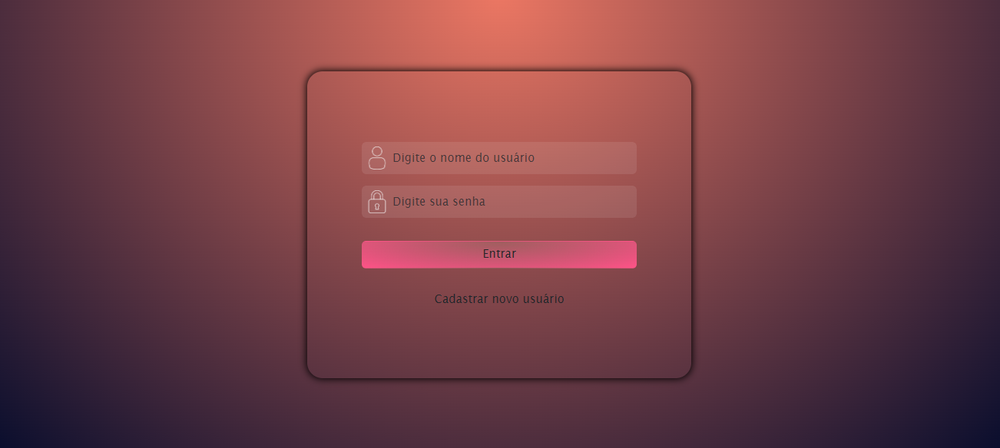
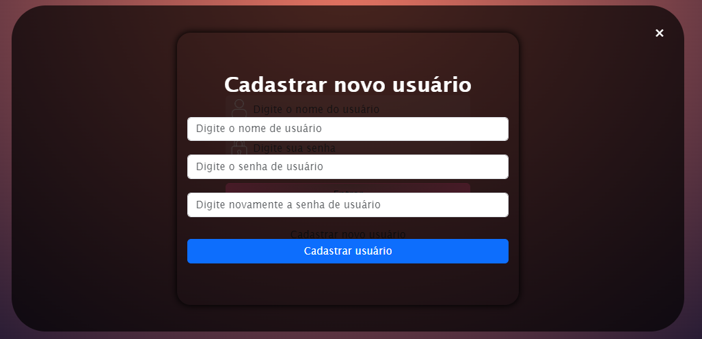
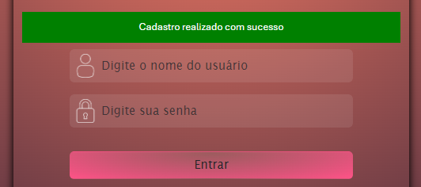

<h1 align="center"> PÁGINA DE LOGIN </h1>

Na busca constante de aprendizado e desenvolvimento das habilidades, concluo este projeto de uma página de login simples, mas objetiva. Meu intuito foi de desenvolver técnicas usando HTML, CSS (SCSS), JavaScript e jQuery. Utilizei também localStorage para o dinamismo com criação de usuário, senha e recuperação destes na hora do login.

# 🔨 Funcionalidades do projeto

- `Funcionalidade 1`: Login de acesso
- `Funcionalidade 2`: Cadastrar novo usuário

# ✔️ Técnicas e tecnologias utilizadas

- ``HTML e CSS``
- ``Bootstrap e SASS``
- ``JavaScript e jQuery``

# 🖼️ Outras imagens

